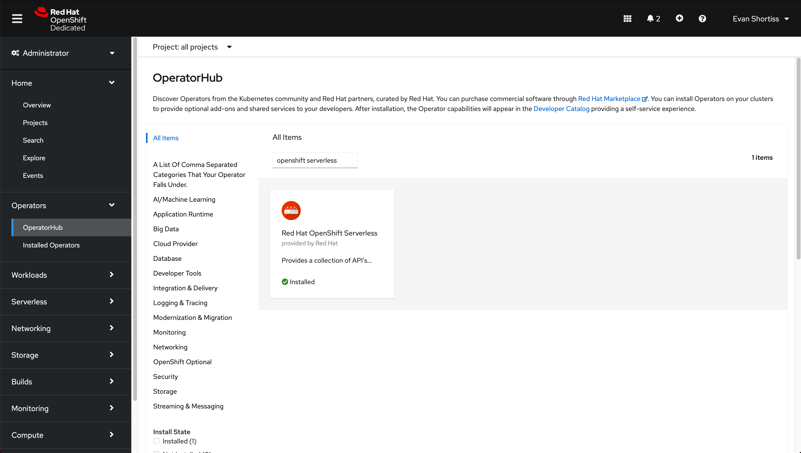
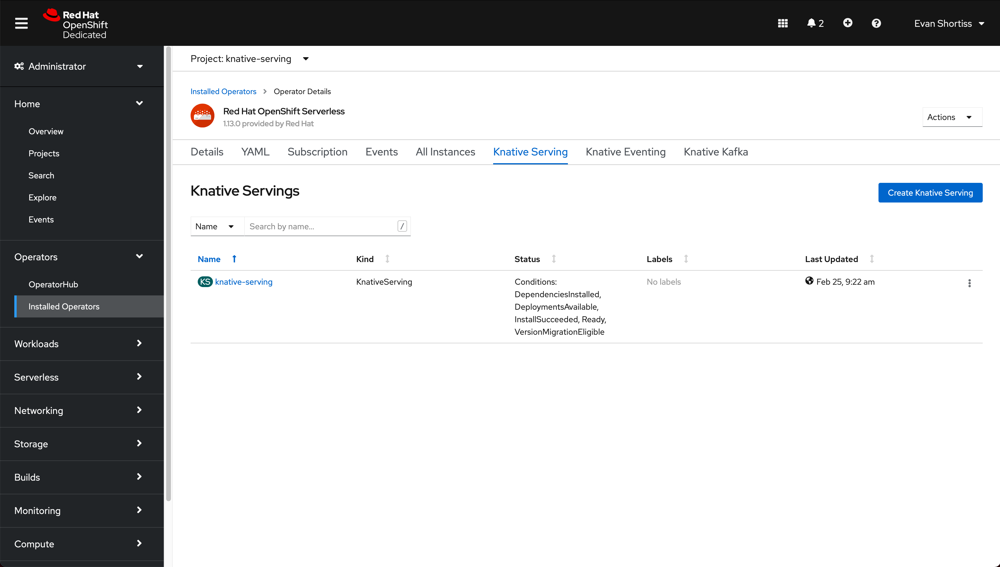
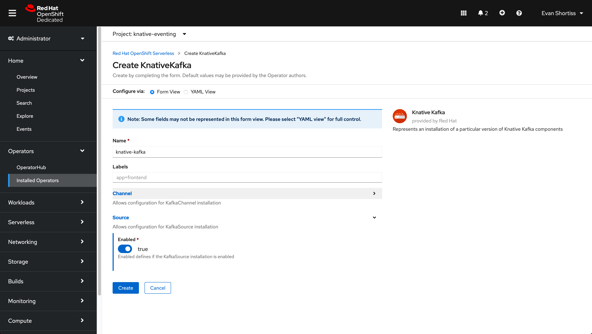
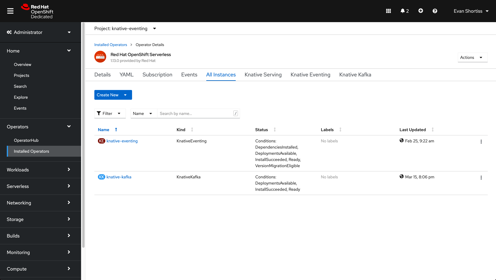
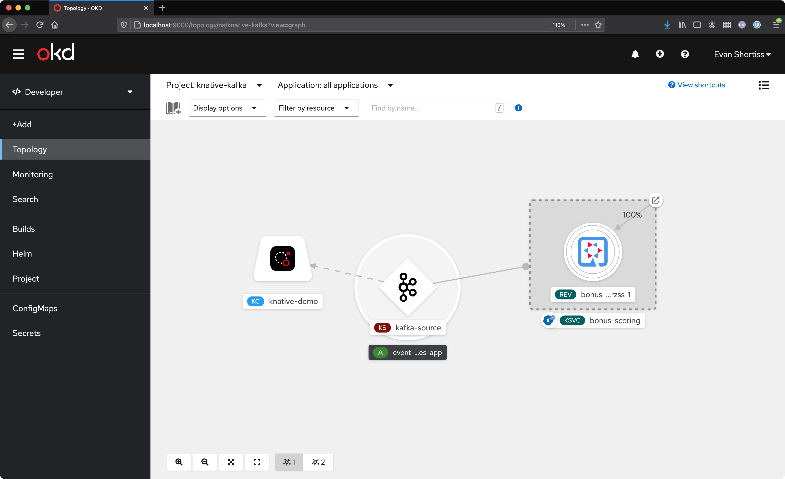
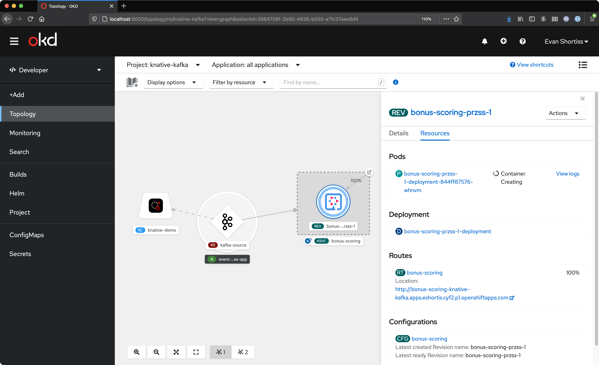
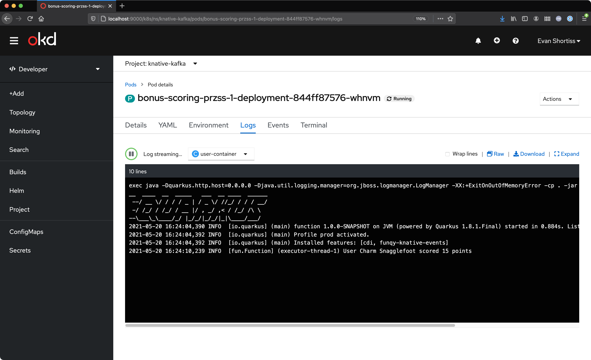

# Red Hat OpenShift Streams and Knative Serving Demo

Demonstrates sourcing events from a Kafka instance running on [Red Hat OpenShift Streams for Apache Kafka](https://cloud.redhat.com/beta/application-services/streams/kafkas),
and processing them using a Quarkus application managed with Knative on and OpenShift Dedicated cluster.

## Requirements

### Software
* [Red Hat OpenShift Application Services CLI (`rhoas`)](https://github.com/redhat-developer/app-services-guides/tree/main/rhoas-cli)
* [Knative CLI (`kn`)](https://knative.dev/v0.20-docs/install/install-kn/)
* [OpenShift CLI (`oc`)](https://docs.openshift.com/dedicated/4/cli_reference/openshift_cli/getting-started-cli.html)
* Account on [cloud.redhat.com](https://cloud.redhat.com/)
* OpenShift Dedicated (OSD) v4.8 Cluster
* [Optional] [Func CLI (`func`)](https://github.com/boson-project/func/releases)

## Local Development

See instructions in the *producer/* and *consumer/* folders.

## Deployment

### Red Hat OpenShift Streams for Apache Kafka Setup

In this section you'll create a Kafka instance, Kafka topic, and a Service
Account to enable authenticated access via SASL SSL.

This can be performed using the following
[Red Hat OpenShift Application Services CLI (`rhoas`)](https://github.com/redhat-developer/app-services-guides/tree/main/rhoas-cli)
commands:

```bash
# Follow the browser based login flow on cloud.redhat.com
rhoas login

# Create a kafka instance named "knative-demo"
rhoas kafka create knative-demo

# Set the context for future commands to operate on knative-demo
rhoas kafka use knative-demo

# Create a topic named "shots" with 5 partitions
rhoas kafka topic create shots --partitions 5
```

If you'd rather use the UI, head over to
[cloud.redhat.com/beta/application-services/streams/kafkas](https://cloud.redhat.com/beta/application-services/streams/kafkas).

### Red Hat OpenShift Serverless Setup

_NOTE: Installing the Red Hat OpenShift Serverless Operator requires a user with the `cluster-admin` role._

The setup for OpenShift Serverless requires you to perform the following steps
on your OpenShift Dedicated cluster:

* Install the Operator
* Create a Knative Serving instance.
* Create a Knative Eventing instance.
* Create a Knative Kafka instance with the **KafkaSource** enabled.

#### Install the Operator
1. Login to your OpenShift Dedicated cluster.
1. Select *Operators > Operator Hub* from the side navigation.
1. Search for "OpenShift Serverless".
1. Install the **Red Hat OpenShift Serverless** operator with default settings.



#### Setup Knative Serving

1. Navigate to the `knative-serving` project.
1. Select *Operators > Operator Hub* from the side navigation.
1. Click the **Red Hat OpenShift Serverless** operator in the list.
1. Select the *Knative Serving* tab.
1. Click the *Create Knative Serving* button.
1. Accept the form default values and click *Create*.

The screenshot below shows the `knative-serving` instance after it has been
created.



#### Setup Knative Eventing

1. Navigate to the `knative-eventing` project.
1. Select *Operators > Operator Hub* from the side navigation.
1. Click the **Red Hat OpenShift Serverless** operator in the list.
1. Select the *Knative Eventing* tab.
1. Click the *Create Knative Eventing* button.
1. Accept the form default values and click *Create*.

#### Setup Knative Kafka

1. Navigate to the `knative-eventing` project.
1. Select *Operators > Operator Hub* from the side navigation.
1. Click the **Red Hat OpenShift Serverless** operator in the list.
1. Select the *Knative Kafka* tab and click *Create KnativeKafka*.
1. Expand the **Source** section of the form set *enabled=true*.



The `knative-eventing` namespace should contain the instances shown in this
screenshot when you've finished:




### OpenShift Knative Consumer Application Setup

Log into the OpenShift (`oc`) CLI and create a project.

```bash
export PROJECT_NAME=knative-kafka-demo

# Obtain a login token and API server URL from your OpenShift cluster
oc login --token=$TOKEN --server=$SERVER

# Create a project on the cluster
oc new-project $PROJECT_NAME
```

Deploy the Quarkus function as a Knative serverless function:

```bash
export IMAGE_NAME=quay.io/evanshortiss/summit-2021-quarkus-funq

# Deploy a pre-built image as a knative service
kn service create bonus-scoring --image $IMAGE_NAME \
-l app.openshift.io/runtime=quarkus \
-n $PROJECT_NAME
```

Connect the Kafka Instance from Red Hat OpenShift Streams for Apache Kafka
to the OpenShift project:

```bash
export KAFKA_INSTANCE=knative-demo

# Follow the browser based login flow on cloud.redhat.com
rhoas login

# Set the context for future commands to operate on knative-demo
rhoas kafka use $KAFKA_INSTANCE

# Follow the interactive connect flow
rhoas cluster connect
```

Lastly, create *KafkaSource* to send items from the *shots* topic to the
serverless function as Cloud Events. This can be performed using the `oc` CLI to create a *KafkaSource* CR:

```bash
export KAFKA_BOOTSTRAP_URL=$(rhoas kafka describe | jq .bootstrapServerHost -r)

oc process -f producer/openshift/kafkasource.template.yml \
-p KAFKA_BOOTSTRAP_URL=$KAFKA_BOOTSTRAP_URL | oc create -f -
```

Or via the UI by:

1. Navigating to your project (`knative-kafka-demo` if using these instructions).
1. Choosing the *Developer* view from the side-menu.
1. Selecting `+Add` from the side-menu.
1. Selecting *Event Source > Kafka Source*.
1. Configure the KafkaSource as follows:
    * Select the Bootstrap Server URL from the dropdown.
    * Enter `shots` for the Topic.
    * Enable SASL.
    * Select the `rh-cloud-services-service-account` keys of `client-id` and `client-secret` for user and password.
    * Enable TLS, but leave the dropdowns unchanged.
1. The resulting form will look similar to this:
1. Click the *Create* button.

The resulting Topology will be similar to the following image.




## Sending Messages to Kafka for Processing

Once you've completed the steps in the **Deployment** section you're ready
to send messages to Kafka.

### Create a Service Acccount

To send messages to the Kafka Instance you'll need a Service Account. Create
one using the CLI:

```bash
# Follow the interactive serviceaccount creation process. This will create
# a file that contains the credentials on your system
rhoas serviceaccount create --file-format env --name $USER

# Make sure to keep the resulting credentials file safe!
```

You can use the SASL credentials with Kafkacat or the included Node.js
producer application.

### Kafkacat

Start a Kafkacat session:

```bash
export KAFKA_SVC_USERNAME=$CLIENT_ID_FROM_SERVICEACCOUNT
export KAFKA_SVC_PASSWORD=$CLIENT_SECRET_FROM_SERVICEACCOUNT
export KAFKA_BOOTSTRAP_URL=$(rhoas kafka describe | jq .bootstrapServerHost -r)
export TOPIC=shots

kafkacat -t $TOPIC -b $KAFKA_BOOTSTRAP_URL \
-X security.protocol=SASL_SSL -X sasl.mechanisms=PLAIN \
-X sasl.username=$KAFKA_SVC_USERNAME \
-X sasl.password=$KAFKA_SVC_PASSWORD -P
```

You can now copy and paste the *knative-consumer/shot.json* into Kafkacat to
send shots to the Kafka instance.

When you paste the JSON the Quarkus service will immediately start, because the
Kafka Source forwards the entries from the `shots` topic to it:



And shortly after it starts the message will be processed:



Use `CTRL+D` keys to close the Kafkacat session.

### Node.js Producer Application

Start the producer included in this repository. This requires Node.js v14 and
npm v6:

```bash
export KAFKACONNECTION_USER=$CLIENT_ID_FROM_SERVICEACCOUNT
export KAFKACONNECTION_PASSWORD=$CLIENT_SECRET_FROM_SERVICEACCOUNT
export KAFKACONNECTION_BOOTSTRAPSERVERS=$(rhoas kafka describe | jq .bootstrapServerHost -r)

cd producer
npm install
npm run dev:remote-kafka
```

You can now send randomised shot payloads by visiting
http://localhost:8080/bonus/single in your browser and refreshing.

